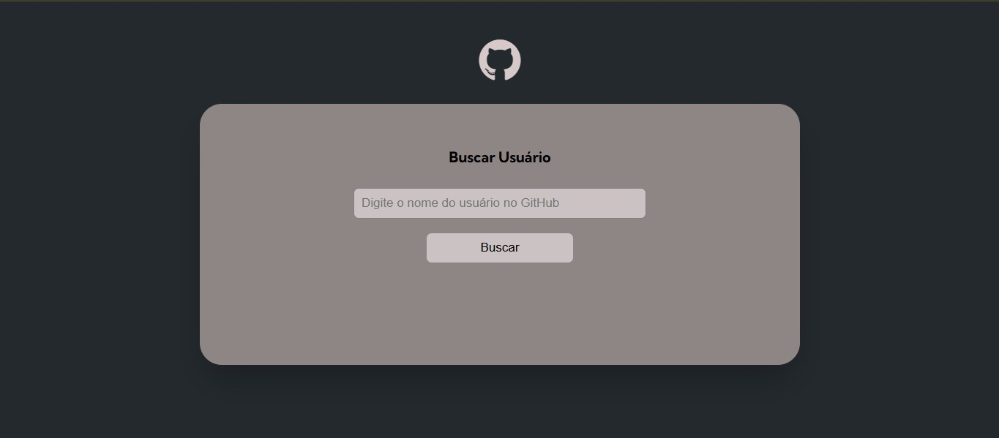
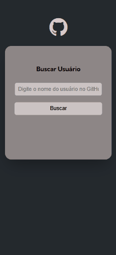

# 🔎 GitHub Fetch API

Aplicação simples que consome a API do GitHub para buscar usuários e listar seus repositórios públicos.

---

## 🎯 Funcionalidades

- Buscar um usuário do GitHub pelo username
- Exibir:
    - Foto de perfil
    - Nome
    - Bio
- Listar repositórios com link direto para cada um
- Tratamento de erro: mensagem de usuário não encontrado
- Alert se o campo do nome do usuário estiver vazio
- Search com a tecla 'Enter'

---

## 🛠️ Tecnologias


---

## 🔧 Ferramentas utilizadas


---

## 🖼️ Layouts

| 💻 Desktop | 🔵 Atividade | 📲 Mobile |
|------------|----------------|-----------|
| |  |  |

---

> 🌐 [Deploy do Projeto](#) 

[](https://cledeocirmarafao.github.io/fetch-api-github/)

> 🖥️ [Hospedagem](#)


---

## 💻 Como Rodar o Projeto Localmente

```bash
# Clone o repositório
git clone https://github.com/cledeocirmarafao/fetch-api-github.git

# Acesse a pasta do projeto
cd fetch-api-github

# Abra o VSCODE
code .

# Abra no navegador
open index.html   # Mac/Linux
start index.html  # Windows

# Se preferir, instale o *Live Server* para visualizar o projeto no navegador
```
---

### ✨ Autor

**Cledeocir Marafão** — ``Desenvolvedor Frontend``

### 📬 Contato

<div align="center">

> Se quiser conversar sobre o projeto ou tecnologia, entre em contato comigo:

  <a href="https://github.com/cledeocirmarafao" target="_blank">
    
  </a>
  <a href="https://www.linkedin.com/in/cledeocir-maraf%C3%A3o-267768193/" target="_blank">
    
  </a>
  <a href="https://www.frontendmentor.io/profile/cledeocirmarafao" target="_blank">
    
  </a>
</div>

## 🔓 Licença

Este projeto está licenciado sob a MIT License - veja o arquivo [LICENSE ↗️](https://opensource.org/license/mit)
 para mais detalhes.